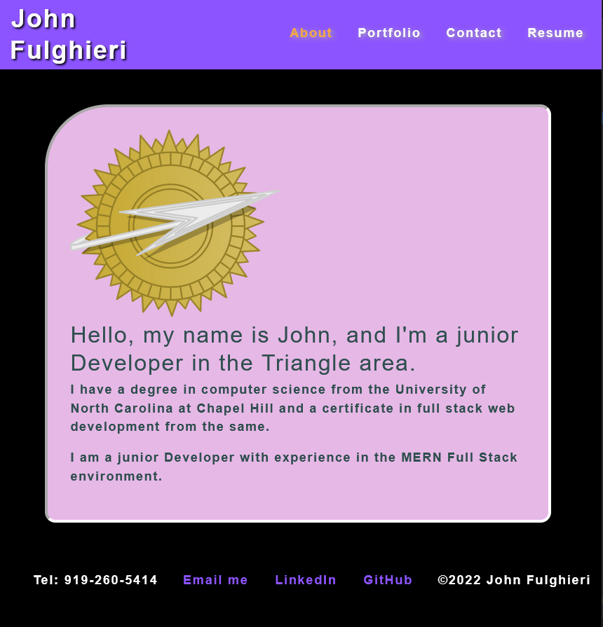

# My Portfolio

## Description

Come and peruse my portfolio!

- [Usage](#usage)
- [Technologies](#technologies)
- [License](#license)
- [Contributing](#contributing)
- [Questions](#questions)

---

## Usage

You can visit my portfolio: [deployed on netlify](https://62a1765950c732197e3887f2--jovial-torrone-9d2ddb.netlify.app/)

## Technologies

This app was built in React.

You to can make react apps with `npx create-react-app`

## License

Copyright (c) 2022.  
Licensed under the [MIT](https://mit-license.org/) license.

---

## Contributing

While I would love for you to improve my portfolio, just a review and constructive criticism is good enough.

## Questions

If you have any questions, my <a href="https://github.com/SrGiovanni">GitHub profile</a> is linked.
